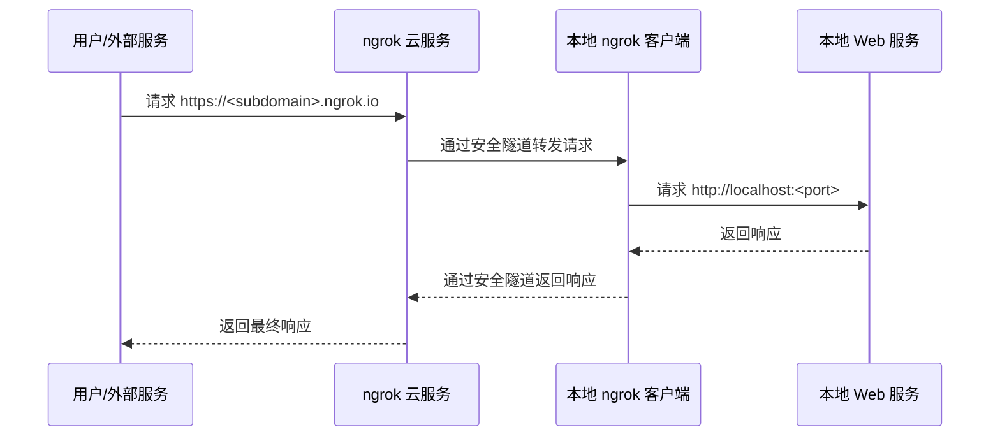

# ngrok 技术文档

## 1. 简介

### 1.1 ngrok 是什么？

ngrok 是一个强大的反向代理工具，它可以将你的本地开发环境暴露在公网上。通过创建一个安全的隧道，ngrok 能够将公网的请求转发到你本地机器上运行的服务。这使得在开发和测试阶段与外部服务（如 Webhooks、APIs）集成变得异常简单。

### 1.2 工作原理

ngrok 的工作原理可以概括为以下几个步骤：

1.  **启动 ngrok 客户端**：你在本地机器上运行 ngrok 客户端，并指定要暴露的本地端口。
2.  **建立安全隧道**：ngrok 客户端连接到 ngrok 云服务，并建立一个安全的加密隧道。
3.  **分配公网地址**：ngrok 云服务会为你分配一个唯一的公网 URL（例如 `https://random-string.ngrok.io`）。
4.  **请求转发**：当有请求发送到这个公网 URL 时，ngrok 云服务会通过隧道将请求转发到你本地的 ngrok 客户端。
5.  **访问本地服务**：ngrok 客户端再将请求转发到你指定的本地端口上运行的服务。



### 1.3 为什么使用 ngrok？

-   **Webhook 开发**：在本地开发和测试需要接收 Webhook 的应用（如 GitHub、Stripe、Twilio）。
-   **API 测试**：让移动应用或其他外部服务可以访问你本地正在开发的 API。
-   **项目演示**：向客户或同事快速演示一个正在开发中的网站或应用，而无需部署到服务器。
-   **调试**：捕获和检查所有通过隧道的 HTTP 请求和响应，方便调试。

---

## 2. 快速入门

### 2.1 下载和安装

1.  **访问官网**：前往 [ngrok 官网](https://ngrok.com/download)。
2.  **下载客户端**：根据你的操作系统（Windows、macOS、Linux）下载对应的 ngrok 客户端。
3.  **解压文件**：下载完成后，解压压缩包。你会得到一个名为 `ngrok` 的可执行文件。

### 2.2 账户和 Authtoken

1.  **注册账户**：在 [ngrok 官网](https://dashboard.ngrok.com/signup) 注册一个免费账户。
2.  **获取 Authtoken**：登录后，在你的 [dashboard](https://dashboard.ngrok.com/get-started/your-authtoken) 页面找到你的 Authtoken。
3.  **配置 Authtoken**：打开终端，进入 ngrok 可执行文件所在的目录，运行以下命令将 Authtoken 添加到默认的配置文件 `ngrok.yml` 中：

    ```bash
    ./ngrok config add-authtoken <YOUR_AUTHTOKEN>
    ```

    配置 Authtoken 后，你将能够使用更多的功能，如自定义子域名、更长的会话时间等。

### 2.3 建立你的第一个隧道

假设你本地有一个在 `8000` 端口上运行的 Web 服务，你可以使用以下命令来为它创建一个公网隧道：

```bash
./ngrok http 8000
```

命令执行后，你会在终端看到类似下面的输出：

```
ngrok by @inconshreveable                                                                                                                                                                                                (Ctrl+C to quit)

Session Status                online
Account                       Your Name (Plan: Free)
Version                       3.x.x
Region                        United States (us)
Web Interface                 http://127.0.0.1:4040
Forwarding                    https://9a1b-2c3d-4e5f-6a7b-8c9d.ngrok.io -> http://localhost:8000

Connections                   ttl     opn     rt1     rt5     p50     p90
                              0       0       0.00    0.00    0.00    0.00
```

现在，你就可以通过 `https://9a1b-2c3d-4e5f-6a7b-8c9d.ngrok.io` 这个公网地址访问你本地 `8000` 端口的服务了。

同时，你也可以通过浏览器访问 `http://127.0.0.1:4040` 来打开 ngrok 的 Web 界面，在这里你可以查看所有通过隧道的请求和响应详情。

---

## 3. 核心概念

### 3.1 隧道协议

ngrok 支持多种协议来创建隧道：

-   **HTTP/HTTPS**：最常用的协议，用于暴露 Web 服务。

    ```bash
    # 暴露本地 80 端口的 HTTP 服务
    ngrok http 80

    # 暴露本地 3000 端口的 HTTPS 服务
    ngrok http https://localhost:3000
    ```

-   **TCP**：用于暴露非 HTTP 的服务，如 SSH、数据库连接、游戏服务器等。

    ```bash
    # 暴露本地 22 端口的 SSH 服务
    ngrok tcp 22
    ```

-   **TLS**：用于暴露需要端到端 TLS 加密的 TCP 服务。

    ```bash
    ngrok tls --domain=your-domain.com 443
    ```

### 3.2 自定义域名

对于付费用户，ngrok 允许你使用自定义的子域名或完全自定义的域名。

-   **自定义子域名**：

    ```bash
    ngrok http --subdomain=my-awesome-app 8080
    ```

    这会将你的服务暴露在 `https://my-awesome-app.ngrok.io`。

-   **自定义域名** (需要付费计划和 CNAME 配置):

    ```bash
    ngrok http --hostname=dev.example.com 80
    ```

---

## 4. 高级用法

### 4.1 配置文件

除了在命令行中指定参数，你还可以通过 `ngrok.yml` 配置文件来定义隧道。这对于管理多个隧道和复杂的配置非常有用。

默认情况下，配置文件位于：

-   **macOS**: `~/Library/Application Support/ngrok/ngrok.yml`
-   **Linux**: `~/.config/ngrok/ngrok.yml`
-   **Windows**: `C:\Users\YourUser\AppData\Local\ngrok\ngrok.yml`

一个配置文件的示例：

```yaml
version: "2"
authtoken: <YOUR_AUTHTOKEN>
tunnels:
  my-api:
    proto: http
    addr: 8080
    subdomain: my-cool-api
  ssh:
    proto: tcp
    addr: 22
```

配置好后，你可以通过名称来启动隧道：

```bash
ngrok start my-api
ngrok start ssh
ngrok start --all # 启动所有定义的隧道
```

### 4.2 安全选项

ngrok 提供了多种安全功能来保护你的隧道：

-   **HTTP 基本认证**：为你的隧道添加用户名和密码保护。

    ```bash
    ngrok http --basic-auth="username:password" 8000
    ```

-   **OAuth 2.0** (付费功能): 与 Google, GitHub, Microsoft 等 OAuth 提供商集成，只有通过身份验证的用户才能访问你的隧道。

    ```bash
    ngrok http --oauth=google --oauth-allow-emails=user@example.com 8000
    ```

-   **IP 限制** (付费功能): 只允许或拒绝特定 IP 地址或 CIDR 范围的访问。

    ```bash
    ngrok http --ip-restriction-allow-cidrs=203.0.113.0/24 8000
    ```

### 4.3 Webhook 验证 (付费功能)

ngrok 可以自动验证来自某些服务（如 Twilio, Stripe）的 Webhook 请求的签名，增加安全性。

```bash
ngrok http --verify-webhook=twilio --verify-webhook-secret=<YOUR_SECRET> 8000
```

---

## 5. API 和集成

ngrok 提供了官方的客户端库，可以让你以编程方式控制隧道。`@ngrok/ngrok` 是官方的 Node.js 库。

### 5.1 安装

```bash
npm install @ngrok/ngrok
```

### 5.2 示例：在 Node.js 应用中启动隧道

```javascript
const ngrok = require("@ngrok/ngrok");

// 设置 Express 应用
const express = require('express');
const app = express();
const port = 8080;

app.get('/', (req, res) => {
  res.send('Hello from local server!');
});

app.listen(port, async () => {
  console.log(`Local server listening at http://localhost:${port}`);

  // 启动 ngrok 隧道
  try {
    const listener = await ngrok.forward({
      addr: port,
      authtoken_from_env: true, // 从 NGROK_AUTHTOKEN 环境变量读取
    });
    console.log(`Ingress established at: ${listener.url()}`);
  } catch (error) {
    console.error("Error establishing ngrok tunnel:", error);
  }
});
```

---

## 6. 常见问题解答 (FAQ)

**Q: ngrok 隧道的地址是固定的吗？**
A: 在免费计划中，每次重启 ngrok 客户端，你都会得到一个新的随机 URL。付费计划的用户可以使用固定的子域名或自定义域名。

**Q: 如何在后台运行 ngrok？**
A: 在 Linux 或 macOS 上，你可以使用 `&` 将其置于后台：`./ngrok http 8000 &`。对于更稳定的方案，建议使用 `systemd` 或 `supervisor` 等工具来管理 ngrok 进程。

**Q: 免费版和付费版有什么主要区别？**
A: 付费版提供更多高级功能，包括：
-   自定义/固定子域名
-   自定义域名
-   更多的并发隧道
-   IP 白名单/黑名单
-   OAuth 集成
-   更长的会v话超时时间

**Q: 我可以同时运行多个隧道吗？**
A: 可以。你可以在配置文件中定义多个隧道并使用 `ngrok start --all` 启动，或者打开多个终端窗口分别运行 `ngrok` 命令。免费版对并发隧道的数量有限制。